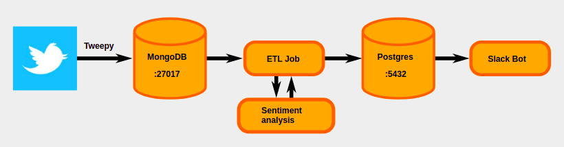

# docker_pipeline_week06
A docker pipeline utilizing Tweepy, MongoDB, PostgresDB and Vader to do sentiment analysis.

## Tweet stream data pipeline for a Slackbot

This project was completed in week 6 of the Data Science Bootcamp at Spiced Academy in Berlin.



This is a simple implementation of a data pipeline using ```docker-compose``` that will:

- collect tweets with the Twitter API and ```tweepy``` as defined in the variable search_query in tweepy/tweepyScript.py (default = "Shanghai Port")
- store the tweets in a MongoDB
- apply the ETL job that
  - extract the tweets from MongoDB
  - take the sentiments of the texts with ```VADERSentiment```
- load the tweets and their sentiment scores in a Postgres database
- create a Slackbot that posts the latest tweet from the Postgres database into a Slack channel, formatted within a snappy sentence.

## Acknowledgements

The tweet_collector.py is taken from [Paul Wlodkowski](https://github.com/pawlodkowski)'s [twitter-mongoDB](https://github.com/pawlodkowski/twitter-mongoDB) repository.

This Readme.md file layout was inspired by https://github.com/mmuratardag implementation of the same project.
